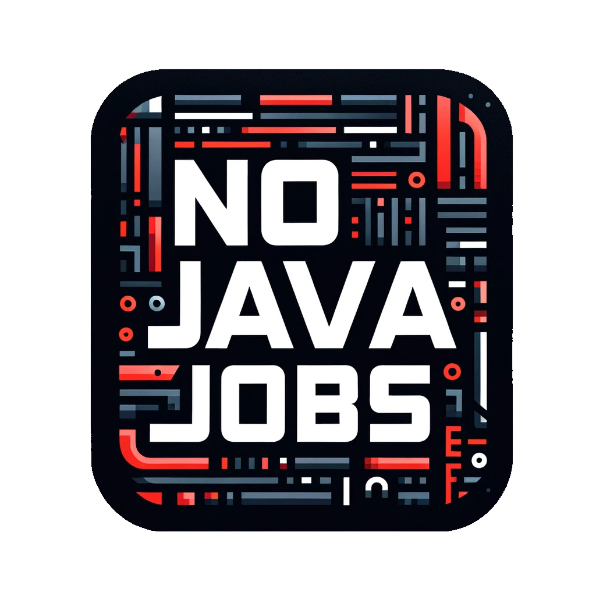

# <a href="https://nojavajobs.io" target="_blank">NoJavaJobs.io</a>

All the software jobs you are looking for... except for Java.

You won't find any jobs that require Java as a skill.

In fact, the only place on our web app where you will find the string "Java" (unless followed by "Script") is our name, NoJavaJobs.

Happy job hunting :)

 

# Why No Java? 

If we have to explain this, you're probably not the target audience. See next section.

 

# What if I do want to see Java positions? 

Heres an article that lists 48 job boards for software engineers <a href="ttps://recruitee.com/articles/bestoboardsoftware-engineers" target="_blank" >https://recruitee.com/articles/best-job-boards-software-engineers</a>

 

# Can we garuntee that once you get hired, you won't be using Java?

Sadly, we can't due to the flexible nature of companies. 

But use your voice. Set boundaries with your employer, and keep an open-mind. Continue to try new technologies!
